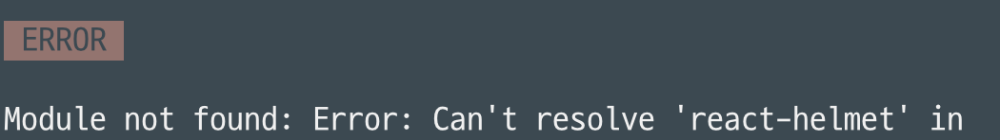

gatsby 블로그를 만들어봤습니다!!

블로그 만드는 방법은 
https://zoomkoding.com/gatsby-github-blog/
https://hislogs.com/make-gatsby-blog/ 
두 블로그 참고했습니다.

로컬로 실행 시켜보니 react-helmet이 없다는 애러가 나와서 
 

 ```
 npm install react-helmet
 ```
 로 해결했습니다
 
 로컬에서 실행해보기
 ```
 yarn gatsby develop
 ```

 이미지가 깨지거나 오류가 있으면
 ```
 yarn gatsby clean
 ```
 을 실행시켜주면 된다고 합니다.

 배포
```
npm run deploy
```


 <Utterances repo='DolmaengC/DolmaengC.github.io' path="path" />