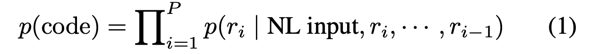
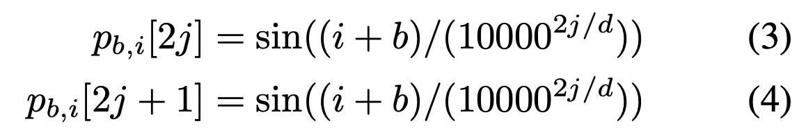
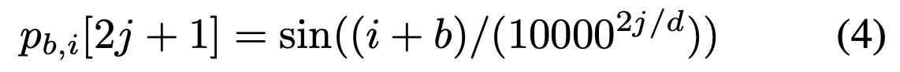

# TreeGen: A Tree-Based Transformer Architecture for Code Generation

**Zeyu Sun† **

**Qihao Zhu† **

**Yingfei Xiong∗† **

**Yican Sun† Lili Mou‡ **

**Lu Zhang†**

## ABSTRCT

코드 생성 시스템은 자연어 묘사를 인풋으로 프로그래밍 언어 코드를 생성한다.

최신 기술들은 뉴럴 네트워크에 의존하는데 , 2가지 문제점이 있다.

1. 긴 의존성 문제
   - 코드는 종종 멀리있는 코드 요소의 영향을 받는다.
2. 모델링 구조
   - 많은 구조적 정보를 가지고 있다.

TreeGen : 새로운 트리 기반 뉴럴 구조 (트렌스포머의 어텐션 메커니즘을 사용)

벤치마크

- 파이썬 벤치마크 : HearthStone
- semantic parsing 벤치마크 : ATIS, GEO

# INTRODUCTION

코드 생성은 개발자들의 생산성을 향상시키기 위한 중요한 인공지능이다.

Seq2Seq, Seq2Tree 모델 등 다양한 신경망 구조를 갖는다.

최신 접근법은 문법 규칙의 sequence를 예측하는 코드를 생성하는 것이다.

이 논문은 새로운 신경망 구조 (TreeGen)을 제안한다.

TreeGen은 트렌스포머 구조를 제안하지만, 기존의 트렌스포머는 프로그램용으로 설계되어 있지 않았으며,

트리 구조에 최적화 되어 있지 않다.

최적화를 위해서는 그래프, 트리 기반의 컨볼루션 신경망 구조를 가져야 한다.

TreeGen은 3부분으로 구성한다.

1. A natural language reader (encoder) : encode the text description.

2. A AST reader (the first several transformer decoder blocks) : 

   encode the previously generated partial code with the structural convolution sub-layers

3. A decoder (the rest transformer decoder blocks) : 

   combine the query and previous two encoders to predict the next grammer rule.

## TreeGen

### 1. Grammar Rule Prediction

decomposed into several context-free grammar rules and parsed as an AST

AST-based code generation could be thought of as expanding a non-terminal node by a grammar rule. This process is repeated until all leaf nodes are terminal.

선주문 트래버스에 따라 오른쪽 상단 모서리에 표시된 AST를 생성하는 일련의 규칙을 얻을 수 있습니다.

Formally, the probability can be factorized as the proba- bilities of the rules generating the code following the order.

our task is to train a model to calculate p(ri | NL input, pi )

### 2. NL Reader

The input description determines the functionality of the code.

1. Tokenize input description into tokens.
2. All the tokens and characters are represented as real-valued vectors n1, n2,...,nL and c1, c2, ... , cs by embeddings. 

In summary, the NL reader has a few Transformer blocks

of self-attention, the gating mechanism, and word convolu-

tion. The natural language description is encoded as features y(NL), y(NL), · · · , y(NL).

### 3. Input Text Representation

#### Character Embedding

Similar words have similar characters (e.g. "program" and "programs")

a token by character embeddings with **a fully-connected layer**

W(c) are the weights and the character sequence is padded to a pre-defined maximum length M.

**Layer normalization**

이 벡터들은 NL reader로 넘어가고 **gating sub-layer**에서 워드 임베딩과 통합된다.

### 4. Neural Structure of NL Reader

The NL reader is composed of a stack of blocks.

Each block contains three different sub-layers (self-attention, gating mechanism, word convolution)

#### Self-Attention

Transformer's architecture

Multi-head attention (to capture long dependency information)

1. Embedding by a look-up table
2. position embeddings
3. Variant (Dehghani et al.)[https://arxiv.org/abs/1807.03819]
4. Compute the position embedding for the 4th word in the word in the bth Transformer block as

#### Gating Mechanism

Self-attention에 의해 특징들이 계산된 후에, character 임베딩 정보와 통합한다.

gating mechanism은 softmax를 베이스로 한다.

#### Word Convolution

2개의 컨볼루션 레이어가 gating 메카니즘의 아웃풋에 적용된다.

여기서 seperable convolution이 사용된다.

-  seperable convolution은 파라미터가 적어서 학습이 쉽다.

첫번째와 마지막 단어를 위해 zero padding을 추가한다.

GELU 활성화 함수 사용

### 5. AST Reader

생성된 부분적 AST의 구조를 모델링하기 위해 AST reader를 만들었다.

문법 규칙의 순서를 예측하여 생성하지만, 이 규칙들만으로는 프로그램에 대한 구체적인 그림이 부족하고 다음 규칙을 예측하기에는 불충분하다.

-> AST reader가 예측된 정보와 트리구조를 포함한 heterogeneous 정보를 고려한다.

이러한 프로그램별 정보를 통합하기 위해 먼저 코드를 일련의 규칙으로 표현한 다음 어텐션 메커니즘으로 규칙을 인코딩하고 마지막으로 트리 컨볼루션 레이어를 사용하여 각 노드의 인코딩된 표현을 조상과 결합합니다.

### 6. AST Representation

**Rule Sequence Embedding**

- 규칙 정보를 인코딩하기 위해서 규칙 ID를 사용한다.
- 규칙들을 table-lookup 임베딩으로 real-valued vectors로 나타낸다.

**Rule Definition Encoding**

- 위의 테이블 조회 임베딩은 문법 규칙을 원자 토큰으로 취급하고 규칙 내용의 정보를 잃습니다.
- 이 문제를 완화하기 위해 규칙 정의의 인코딩으로 규칙 표현을 향상시킵니다.

**Position and Depth Embeddings**

Position embedding

### 7. Neural Structure of AST Reader

four sub-layers (self-attention, gating mechanism, NL attention, tree convolution)

residual connection except the layer of tree convolution

layer normalization

**Self-Attention**

Transformer-like self-attention layer

input : sum of the rule embedding, position embedding, dept embedding

extract features

**Gating Mechanism**

Content-encoding rule representation

Transformer-extracted features

**NL Attention**

Multi-head NL attention (similar to the Transformer decoder's attention to its encoder)

**Tree Convolution**

### 8. Decoder

### 9. Training and Inference

 

