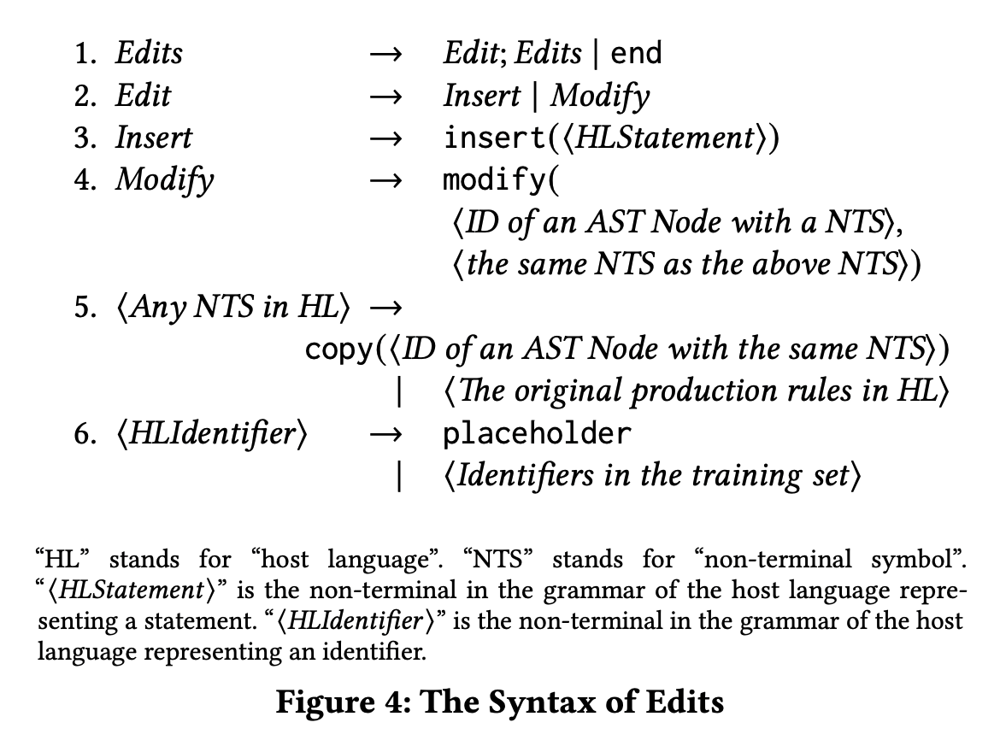
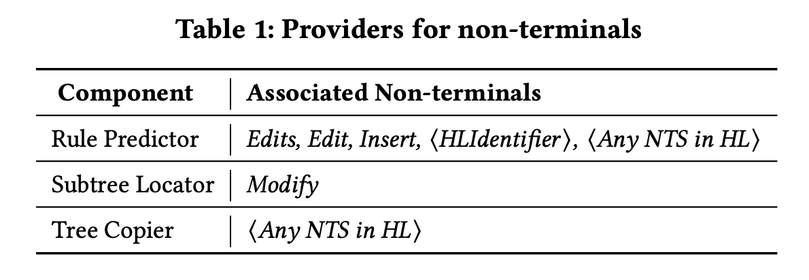
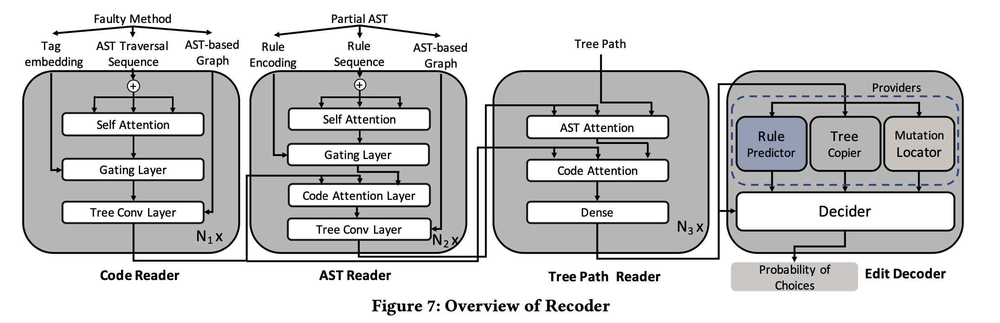
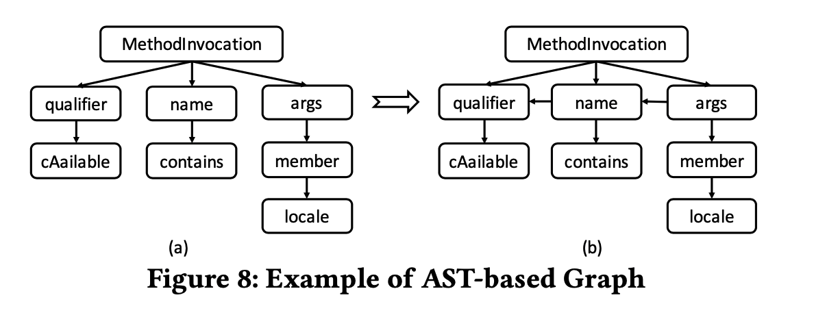
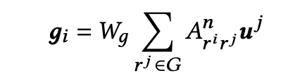
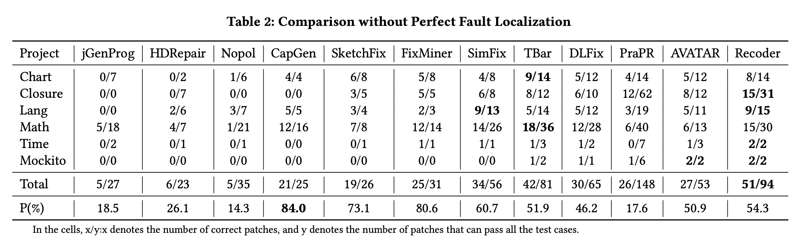
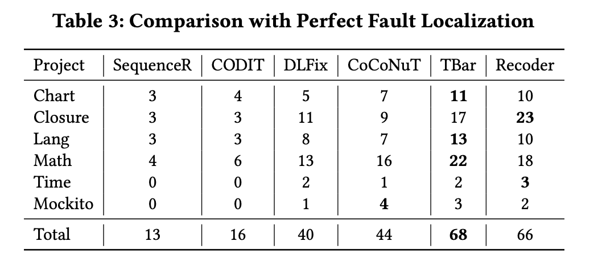
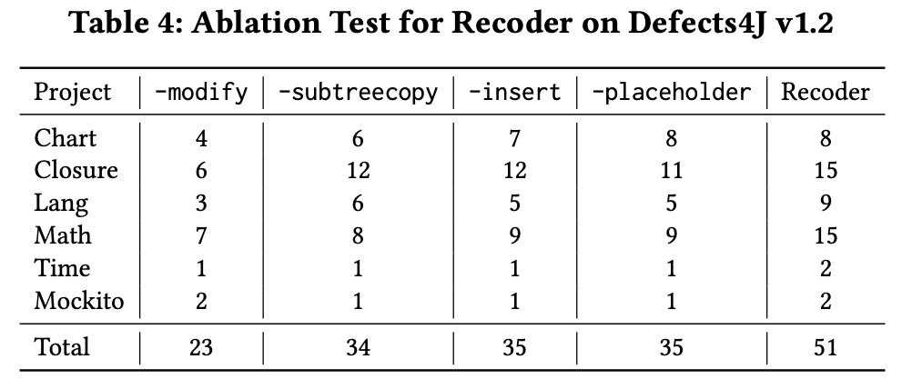
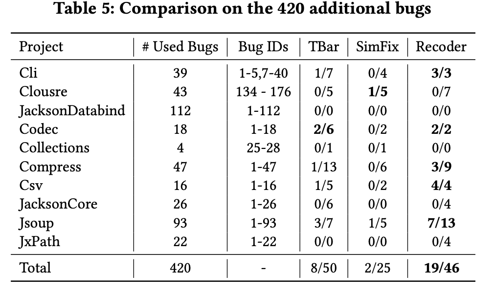
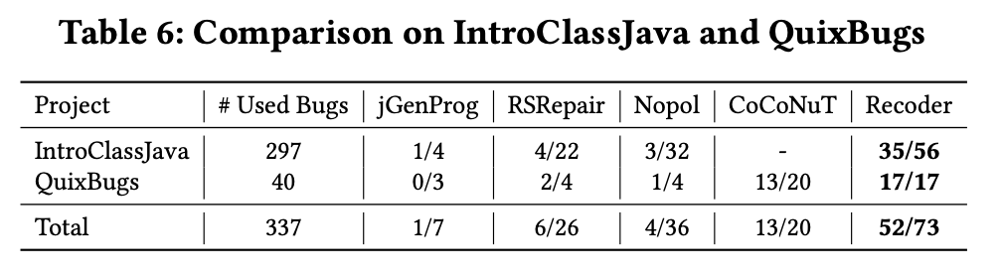

# A Syntax-Guided Edit Decoder for Neural Program Repair

**Qihao Zhu**
 Key Laboratory of HCST, MoE DCST, Peking University Beijing, China Zhuqh@pku.edu.cn

**Zeyu Sun**
 Key Laboratory of HCST, MoE DCST, Peking University Beijing, China szy_@pku.edu.cn

**Yuan-an Xiao**
 Key Laboratory of HCST, MoE DCST, Peking University Beijing, China xiaoyuanan@pku.edu.cn

**Wenjie Zhang**
 Key Laboratory of HCST, MoE DCST, Peking University Beijing, China zhang_wen_jie@pku.edu.cn

**Kang Yuan**
 Stony Brook University New York, US kang.yuan@stonybrook.edu

**Yingfei Xiong**

Key Laboratory of HCST, MoE DCST, Peking University Beijing, China xiongyf@pku.edu.cn

**Lu Zhang**
 Key Laboratory of HCST, MoE DCST, Peking University Beijing, China zhanglucs@pku.edu.cn

**KEYWORDS**

Automated program repair, Neural networks

**ACM Reference Format:**

Qihao Zhu, Zeyu Sun, Yuan-an Xiao, Wenjie Zhang, Kang Yuan, Yingfei Xiong, and Lu Zhang. 2021. A Syntax-Guided Edit Decoder for Neural Program Repair. In Proceedings of the 29th ACM Joint European Software Engineering Conference and Symposium on the Foundations of Software Engi- neering (ESEC/FSE ’21), August 23–28, 2021, Athens, Greece. ACM, New York, NY, USA, 13 pages. https://doi.org/10.1145/3468264.3468544

[Link](https://dl.acm.org/doi/abs/10.1145/3468264.3468544?casa_token=7YNel2Xox8EAAAAA:6Exp9p20FNVhkgXEIy-PjW8BoPAF_23tte2da-A5xEXNKNbhGqZ9gGhM_kb5rpF11-wo0nqIng_LHfE)

## ABSTRACT

## 1. INTRODUCTION

DL 기반 APR 접근 방식은 아직 기존 APR 접근 방식을 능가하지 못했습니다.

우리는 기존의 DL 기반 APR 접근 방식이 APR에 대해 다른 인코더 아키텍처를 제안했지만 디코더 아키텍처가 표준 아키텍처로 남아 원래 결함이 있는 프로그램 조각을 대체하기 위해 토큰 시퀀스를 하나씩 생성한다는 것을 관찰했습니다. 이 표준 디코더를 사용하면 DL 기반 APR의 성능이 크게 제한됩니다. 여기서 우리는 세 가지 주요 제한 사항을 강조합니다.

### Limitation 1: Including syntactically incorrect programs in the patch space.

### Limitation 2: Inefficient representation of small edits.

### Limitation 3: Not being able to generate project-specific identifiers.

### Novelty 1: Syntax-Guided Edit Decoding with Provider/Decider Architecture

### Novelty 2: Placeholder Generation

## 2. EDITS

The syntax and semantic of edits and their relations to providers

### 2.1 Syntax and Semantics of Edits

* Host language : 별도의 소프트웨어가 설치되어 있지 않은 컴퓨터에서도 사용할 수 있는 프로그래밍 언어. 일반적으로 컴퓨터에서 사용되는 기계어가 이에 해당한다고 할 수 있지만, 몇몇 컴퓨터에서는 운영 체제에서 지원하는 고급 언어를 이 언어로 제공하고 있다.
* Non-terminal symbol : <>로 둘러쌓인 기호를 논터미널 기호라고 부른다.

Recoder는 특정 프로그래밍이 아닌 모든 프로그래밍 언어에 적용할 수 있다. (Host Language)

**Rule 1**

- Edits은 Edits, Edit, end가 될 수 있다.

**Rule 2**

- Edit은 Insert 혹은 Modift operation이다.

**Rule 3** (the syntax of insert operation)

- Insert operation은 faulty statement 앞에 새로운 statement를 생성한다.
- Insert operation has one parameter
  - HLStatement
    - non-terminal in the grammar of the host language that represents a statement
      - Non-terminal could be expanded into a full statement or copy operation

**Rule 4** (the syntax of modify operation)

- Modify operation은 faulty statement를 가진 AST subtree를 새로운 AST subtree로 바꾼다.
- Modify operation has two parameter
  - First parameter : 교체될 AST subtree로부터의 root node의 ID
    - ID는 pre-order traveral sequence의 노드 순서로 정의된다.
      - 6번째로 방문한 노드는 ID 6
  - Second parameter : an AST subtree whose root node has the same symbol
    - the replacement ensures syntactic correctness
    - the subtree to be replaced should have more than one node

**Rule 5**

- a meta-rule applied to any non-terminal symbol of the host language.
- add production rule that expands it into a copy operation
- the neural network could choose to directly gerate a new subtree or to copy one
- For both insert and modify, they generate a new AST subtree
  - the AST subtree being inserted or modified is not completely original
    - Copy operation is introduced to further reduce the patch space
- copy operation
  - 1 parameter identifies the root node of the AST subtree to be copied
    - the faulty statement or its context
    - method surrounding the faulty statement
  - the root node of the subtree to be copied should have the same non-terminal symbol as the symbol being extended

**Rule 6 **(placeholder)

- to generate concrete identifiers
- change identifier nodes into non-terminals
- plceholder or one of the frequent identifiers in the training set

### 2.3 Generation of Edits

Providers : provide choices and estimate their probabilities

3 type of providers

**rule predictor**

- 선택 사항을 제공하고 각 production rule의 확률을 계산
- Neural component 
  - 각 생성 규칙에 대한 확률을 할당
- Logic component
  - 왼쪽이 해당 non-terminal이 아닌 rule의 확률을 0으로 재설정
  - 나머지 확률을 정규화

**subtree locator**

- 선택 사항을 제공
- Faulty statement에서 크기가 1보다 큰 각 AST 하위 트리의 확률을 추정

**tree copier**

- 선택 사항 제공
- Faulty statement를 둘러싼 method의 크기가 1보다 큰 각 AST subtree의 확률을 추정
- neural component
- logic component
  - root symbol이 확장되는 non-terminal symbol과 다른 subtree의 확률을 재설정

**decider**

- 각 provider에 확률을 할당
- similar logic component
  - provider가 현재 non-terminal symbol을 담당하지 않을 경우, 확률을 0으로 재설정

## 3 MODEL ARCHITECTURE

Recoder is based on the syntax guided code generation model, [TreeGen](https://ojs.aaai.org/index.php/AAAI/article/view/6430)

input : a faulty statement and its comtext

output : edits

Beam search (to find the best combination of choices for generating the complete edits)

4 main component

- code reader
- AST reader
- tree path reader
- Edit decoder

AST reader, tree path reader : TreeGen

Code reader, edit decoder : newly introduced

### 3.1 Code Reader

input

- AST traversal sequence
  - a sequence of tokens following the pre-order traversal of the AST
  - word embedding
- Tag embedding
  - Pre-order traversal of the AST
  - tag
    1. in the faulty statement
    2. In the statement before the faulty statement
    3. In the statement after the faulty statement
    4. in other statements
- AST-based Graph
  - directional graph where the nodes are AST nodes and the edges link a node to each of its children and its sibling
  - 

#### 3.1.1 Self-Attention

- self-attention sub-layer
  - encoding the AST traversal sequence
  - [Transformer](https://proceedings.neurips.cc/paper_files/paper/2017/hash/3f5ee243547dee91fbd053c1c4a845aa-Abstract.html) architecture
    - Capture the long dependency information in the AST
- Position embedding (represent positional information)
- multi-head attention layer
  - capture non-linear features
  - The single attention layer maps the query Q, the key K, and the value V into a weighted-sum output

#### 3.1.2 Gating Layer

- input : self-attention 레이어의 아웃풋 + 태그 임베딩
- output : 𝒖𝑖 =Gating(𝒂𝒊,𝒂𝒊,𝒕𝑖).
- TreeGen에서 정의된 Gating mechanism이 이 레이어에서 사용되었다. (softmax 기반)

#### 3.1.3 Tree Conv Layer

- input : gating layer의 아웃풋 + AST-based graph

- output : The encoding of the neighbors is directly added to the input vector

- GNN layer
- encode the neighbors

- 𝑊g is the weigh of a fullt -connected layer and A is a normalized adjacency matrix of G

### 3.2 AST Reader

- Encode the partial generated AST of the edit (TreeGen)
- Rule sequence
  - represented as real-value vectors
  - fed into a self-attention layer

### 3.3 Tree Path Reader

- Encode the information of the non-terminal node to be expanded (TreeGen)
- Represent the non-terminal node as a path from the root to the node to be expanded
- Transforms the nodes in this path into real-value vectors
- Two fully-connected layers are followed to extract features for edit decoder

### 3.4 Edit Decoder

#### 3.4.1 Provider

- Input : tree path reader의 아웃풋

- output : the probability of choices for different non-terminals

**Rule Predictor**

- Estimate the probability of each production rule in the grammar of edits
- Neural component (a fully-connected layer)
- Normalized via softmax
- Invalid rules whose left-hand side is not the corresponding non-terminal are not allowed
- The logic component resets the output of the fully-connected layer to -∞.

**Tree Copier**

- Designed for any non-terminal symbol in the grammer of edits to choose a subtree in the local context
- Neural component (a pointer network)
- The logic component resets  𝜽 to −∞ if the root symbol of the corresponding subtree is different from the symbol being expanded.
- Normalized via softmax

**Subtree Locator**

output : an ID of the subtree in the faulty statement for not-terminal symbol, Modify, in the grammar of edits.

#### 3.4.2 Decider

- Estimate the probability of using each provider
- Neural component
  - input : the output of the tree path reader
  - output : the probability of using each provider
  - A fully-connected layer
- Logic component resets 𝝀 to −∞ if the corresponding provider is not responsible for the symbol being expanded following Table 1.
- Normalized via softmax

## 5 EXPERIMENTAL RESULTS

---

---

---

---

---

